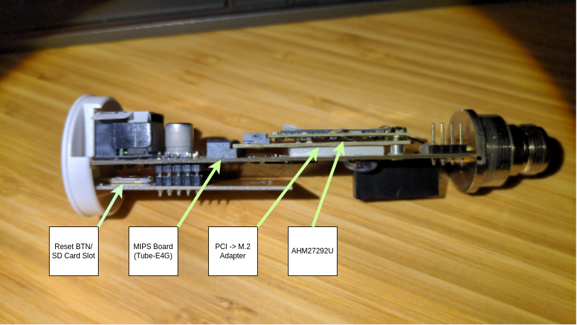

# Alfa-Tube-AH-Info
Dump of configs and docs for the Alfa Tube-AH
	

# Getting Started 
[Docs for AHM27292U](https://docs.alfa.com.tw/Product/AHM27292U/) -- While not explicitly for the Tube-AH, this is the module installed inside the Tube-AH via PCI -> M.2 adapter. 
[Factory Firmware DL from Alfa](https://drive.google.com/file/d/1KSlgDL66AJUVrZjVxHLGtyePOj-y7iDj/view?usp=share_link) -- At this time, there is no firmware on [Alfa's website](https://files.alfa.com.tw/). This link was provided by their customer support team 
[Newracom (chipset manufacturer) docs](https://github.com/newracom/nrc7292_sw_pkg/blob/master/package/host/doc/UG-7292-003-S1G_Channel.pdf) -- Page 5 for channel mapping, as the firmware shows only 2.4 and 5ghz bands due to wpa_supplicant not supporting sub-1ghz bands.  
 
**NOTE**: The firmware above boots, but appears to be lacking the nessecary drivers and kernel modules to support the nrc7292 chipset 
**NOTE**: For the firmware above, the IP is 192.168.1.254 and the webconsole is available on 8022/tcp ([Click here!](http://192.168.1.254:8022)) 
This is the reason I am uploading everything from a fresh device, in case it helps somebody else.

# Wild Ravings From an Insane Man
The Tube-AH is an odd device.  
Out of the box, it has two installs of OpenWRT running. One is exposed over 192.168.1.1, the other is 192.168.1.254.  
The .1 interface has the following:  
>  OpenWrt SNAPSHOT, r17031+232-e6b3e77e6e   
> root@OpenWrt:~# uname -ar  
> Linux OpenWrt 5.10.54 #0 SMP Sat Jul 31 18:41:15 2021 armv7l GNU/Linux

The .254 interfaces shows: 
> OpenWrt 22.03-SNAPSHOT, r19522-5c7aed8b1e  
> root@OpenWrt:~# uname -ar  
> Linux OpenWrt 5.10.127 #0 Mon Jul 4 21:40:43 2022 mips GNU/Linux  

This leads me to believe that the base board (Tube E4G) is running the MIPS install, and the AHM27292U module is running the ARM7L install. It may be obvious to others, but this is the first time I've seen this type of device before.
